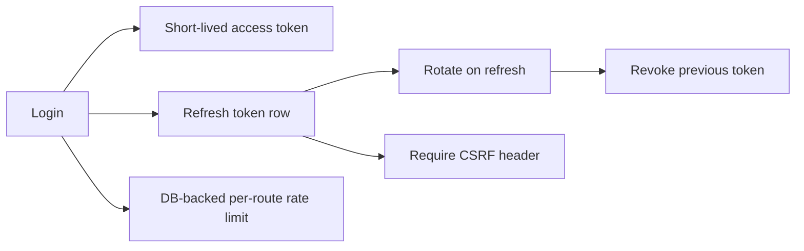

## adr_000_cloud_auth_hardening_refresh_rotation_db_rate_limits - Cloud auth hardening (refresh rotation + DB rate limits)
> Date: 2026-01-31
> Status: Proposed
> Drivers: Multi-instance-safe auth hardening, refresh abuse protection, persistent rate-limit correctness, CSRF refresh protection
> Related request: logics/request/req_047_security_pwa_offline_ci_hardening_and_maintainability.md
> Related backlog: logics/backlog/item_036_harden_cloud_auth_rate_limiting.md
> Related task: logics/tasks/task_031_harden_cloud_auth_rate_limiting.md
> Reminder: Update status, linked refs, decision rationale, consequences, migration plan, and follow-up work when you edit this doc.

# Overview
Make cloud authentication safe for multi-instance deployments by persisting rate-limit state in Postgres, rotating refresh tokens, and enforcing CSRF on refresh without changing the high-level client flow.

# Context
The cloud auth endpoints were MVP‑grade: in‑memory rate limiting, stateless refresh tokens, and no CSRF protection.
This is unsafe for multi‑instance deployments and exposes the refresh endpoint to abuse. Constraints: serverless on
Render, no external rate‑limit store (Redis), Postgres is available, and the client flow must remain compatible.

# Decision
Adopt Postgres‑backed auth hardening:
- Store refresh token identifiers (hashed) with expiry and revoke on every refresh (rotation).
- Enforce double‑submit CSRF protection for refresh (cookie + `x-csrf-token` header).
- Implement per‑IP + per‑route rate limiting using Postgres counters with a fixed time window.

This keeps the existing client auth flow while making it multi‑instance safe.

# Alternatives considered
- Keep in‑memory rate limiting and stateless refresh tokens (unsafe across instances).
- Introduce Redis for rate limiting (not available in current infra).
- Rely on short access token TTLs only (does not protect refresh abuse).

# Consequences
- Additional DB writes on auth/refresh and rate‑limit checks.
- Requires periodic cleanup of expired refresh tokens / rate‑limit rows (can be a cron/maintenance task).
- Client must send CSRF header on refresh (already implemented).

# Migration and rollout
- Add the supporting database tables/indexes before enabling the new auth flow in production.
- Roll out backend validation and token rotation together so clients never mix old refresh semantics with new server rules.
- Backfill or invalidate legacy refresh tokens as needed during deployment.

# Follow-up work
- Add bounded cleanup for expired/revoked refresh token rows.
- Revisit trust boundaries for rate-limit key derivation behind proxies.
