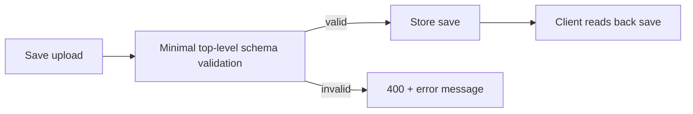

## adr_001_server_side_save_payload_validation_minimal_schema - Server-side save payload validation (minimal schema)
> Date: 2026-01-31
> Status: Proposed
> Drivers: Cloud save data integrity, malformed payload rejection, forward-compatible validation, low-maintenance schema enforcement
> Related request: logics/request/req_015_technical_review.md
> Related backlog: logics/backlog/item_037_validate_cloud_save_payloads.md
> Related task: logics/tasks/task_032_validate_cloud_save_payloads_server_side.md
> Reminder: Update status, linked refs, decision rationale, consequences, migration plan, and follow-up work when you edit this doc.

# Overview
Validate cloud save uploads against a shallow server-side schema so clearly malformed payloads are rejected early while still allowing forward-compatible unknown fields.

# Context
The backend currently accepts any JSON for cloud saves. Corrupted or incompatible payloads can be stored and later
break clients. We need server‑side validation without blocking forward compatibility or adding heavy schema tooling.

# Decision
Implement a minimal, shallow save schema validation on the server:
- Require `version` and `players` at the top level.
- Validate types for optional fields (e.g., `schemaVersion`, `lastTick`, `inventory`, `quests`).
- Allow unknown fields for forward compatibility.
- Return 400 with a clear error message and log validation failures.

# Alternatives considered
- Full deep validation of all nested fields (high maintenance, version coupling).
- Client‑only validation (server still stores invalid data).
- JSON Schema runtime with a full schema (heavier deps and maintenance).

# Consequences
- Some malformed payloads will be rejected early (data integrity improves).
- Server stays shallow; clients retain migration responsibility.
- Error logs add visibility for invalid upload attempts.

# Migration and rollout
- Add the validator behind the existing save upload route without changing response shape for valid payloads.
- Deploy alongside backend tests that cover valid and invalid payload examples.
- Monitor error logs for rejected payloads after rollout to catch unexpected client mismatches.

# Follow-up work
- Revisit whether additional top-level fields should become required in future schema versions.
- Add structured diagnostics if validation failure volume becomes operationally relevant.
