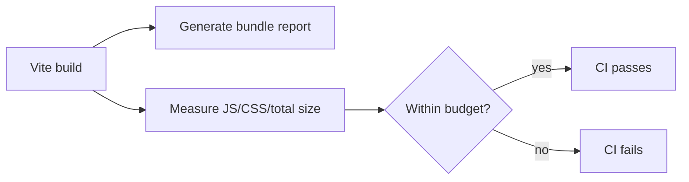

## adr_002_bundle_size_budgets_with_ci_enforcement - Bundle size budgets with CI enforcement
> Date: 2026-01-31
> Status: Proposed
> Drivers: Bundle growth guardrails, CI-enforced performance budgets, reproducible asset reporting, release-time visibility
> Related request: logics/request/req_043_bundle_performance_leaderboard_scalability_and_ci_flaky_hardening.md
> Related backlog: logics/backlog/item_043_bundle_perf_budgets.md
> Related task: logics/tasks/task_038_add_bundle_size_and_perf_budgets.md
> Reminder: Update status, linked refs, decision rationale, consequences, migration plan, and follow-up work when you edit this doc.

# Overview
Introduce lightweight bundle size budgets and an inspectable build report so regressions are caught automatically in CI instead of being discovered after release.

# Context
Bundle size has no guardrails today. Regressions can slip into main without notice, impacting load time and UX.
We need a lightweight, CI‑enforced budget and a human‑readable report.

# Decision
Add build‑time bundle reporting + CI budgets:
- Generate `dist/bundle-report.html` via Vite/Rollup visualizer.
- Enforce max JS/CSS/total sizes using a small Node script reading `scripts/bundle-budgets.json`.
- Run the budget check in CI and release workflows after `npm run build`.

# Alternatives considered
- Manual review of build artifacts (easy to miss regressions).
- Lighthouse budgets only (slower to run and less direct on asset sizes).
- External SaaS bundle monitoring (not needed for current scope).

# Consequences
- CI will fail when budgets are exceeded, requiring deliberate budget updates.
- Budgets depend on a successful build (must run before check).
- Report is generated on each build for local inspection.

# Migration and rollout
- Add budget config and report generation to the existing build pipeline first.
- Enable CI enforcement once thresholds are calibrated against current bundle size.
- Publish the generated report as a local/dev artifact for diagnosis.

# Follow-up work
- Revisit thresholds when large optional surfaces are lazily split.
- Consider per-chunk budget visibility if future regressions become harder to localize.
