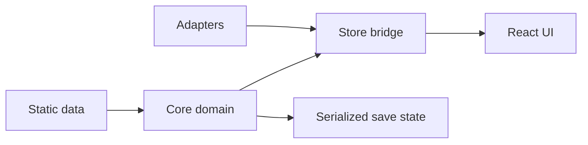

## adr_003_ts_rewrite_blueprint - TypeScript rewrite blueprint
> Date: 2026-01-31
> Status: Accepted
> Drivers: Core/UI separation, typed serialized state, incremental rewrite safety, maintainable project structure
> Related request: logics/request/req_015_technical_review.md
> Related backlog: logics/backlog/item_003_ts_rewrite.md
> Related task: logics/tasks/task_002_ts_rewrite_plan.md
> Reminder: Update status, linked refs, decision rationale, consequences, migration plan, and follow-up work when you edit this doc.

# Overview
Define the target TypeScript architecture for the game so the rewrite keeps gameplay logic isolated from UI concerns, serializable state remains explicit, and future features can be added without rebuilding the project structure again.

# Context
The original JavaScript structure mixed runtime logic, persistence behavior, and UI concerns. The rewrite needed a durable target architecture before moving the codebase to TypeScript, otherwise types would simply fossilize the old coupling.

# Decision
Adopt the following layered architecture:
- Core (pure domain): game loop, progression, offline catch-up, and rules. No DOM.
- Adapters: persistence, clock/visibility, randomness, and integration boundaries.
- UI (React): view models + components only, driven by core/store state.
- Data: static definitions for skills, recipes, actions, and balance values.
- Store: bridge between UI and core, exposing subscribe/get/dispatch.

IDs are string-based and typed in TS (`PlayerId`, `SkillId`, `RecipeId`, `ActionId`, `ItemId`).

Runtime state stays explicitly serializable:
- `StorageState`
- `RecipeState`
- `SkillState`
- `PlayerState`
- `LoopState`
- `GameState`

Static definitions remain non-serialized:
- `SkillDefinition`
- `RecipeDefinition`
- `ActionDefinition`

Save schema v1 (`localStorage`) stores:
- `version`
- `lastTick`
- `activePlayerId`
- `players`

`actionProgress` remains runtime-only and is stripped from save data.

# Alternatives considered
- Keep a mixed UI/runtime architecture and add TS incrementally on top.
- Move directly to a heavier framework/store abstraction before stabilizing domain boundaries.
- Put persistence and runtime concerns directly in React hooks/components.

# Consequences
- The rewrite has a clear destination instead of ad hoc file-by-file conversion.
- Core logic becomes easier to test and reason about independently from React.
- New code has an explicit home, which reduces architectural drift.

# Migration and rollout
- Move pure domain logic into `src/core` first.
- Introduce `src/store` as the typed bridge using `subscribe/get/dispatch`.
- Keep React bindings on `useSyncExternalStore`.
- Migrate persistence and other side effects into `src/adapters`.
- Keep static definitions in `src/data` and shared styles in `src/styles`.

# Follow-up work
- Revisit whether branded ID helpers should be formalized or kept lightweight.
- Continue splitting hot runtime/UI modules when they grow beyond their current responsibilities.
