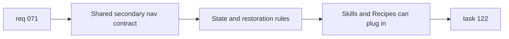

## item_250_define_shared_wiki_secondary_navigation_contracts_and_state_behavior - Define shared wiki secondary navigation contracts and state behavior
> From version: 0.9.41
> Status: Ready
> Understanding: 95%
> Confidence: 95%
> Progress: 0%
> Complexity: Medium
> Theme: UX / Navigation / State modeling
> Reminder: Update status/understanding/confidence/progress and linked task references when you edit this doc.

# Problem
- The wiki already works as a `list + detail` reference surface, but its section navigation is still uneven.
- `Items` already behaves like the target pattern with a visible second level, while `Skills` and `Recipes` still need an equivalent structure.
- Before changing the UI broadly, the wiki needs a shared contract for:
  - which sections expose a secondary navigation level,
  - how those options are modeled,
  - how selection state is restored and kept coherent with the current route and active entry.

# Scope
- In:
- Define the shared second-level wiki navigation model for sections that support it.
- Clarify which sections use the pattern in this slice:
  - `Items` as the reference behavior,
  - `Skills` with type-based switching,
  - `Recipes` with skill-based switching,
  - `Dungeons` excluded for now.
- Define default selection behavior so the first render stays intuitive.
- Extend wiki state or route handling only if needed to represent active secondary selection cleanly.
- Preserve existing section and entry selection behavior where possible.
- Out:
- Final rendering and interaction polish for the new UI controls.
- Mobile-specific adaptive layout treatment.
- Exhaustive regression coverage beyond the minimal support needed to land the state model.

# Acceptance criteria
- A shared wiki secondary-navigation contract exists for sections that need a second level.
- `Items` remains the reference behavior and is not reworked into a different navigation model.
- `Skills` and `Recipes` each have a defined secondary-navigation state model with clear default selection rules.
- `Dungeons` remains explicitly outside the second-level model for now.
- Current wiki route and entry restoration behavior stays coherent after the state-model update.

# AC Traceability
- AC1 -> Scope: shared secondary-navigation model. Proof: wiki model and container wiring support the defined sections.
- AC2 -> Scope: `Items` stays the reference behavior. Proof: no regression to its current category logic.
- AC3 -> Scope: `Skills` and `Recipes` state model. Proof: deterministic defaults and secondary-selection persistence rules exist.
- AC4 -> Scope: `Dungeons` exclusion. Proof: no placeholder second-level model is introduced there.
- AC5 -> Scope: route and entry coherence. Proof: existing wiki restoration still resolves to a valid section and entry.

# Decision framing
- Product framing: Consider
- Product signals: navigation and discoverability
- Product follow-up: No product brief is required unless the wiki navigation scope expands beyond the current UX normalization pass.
- Architecture framing: Consider
- Architecture signals: data model and persistence, contracts and integration
- Architecture follow-up: No ADR is required unless route-state persistence becomes materially more complex during implementation.

# Links
- Product brief(s): (none yet)
- Architecture decision(s): (none yet)
- Request: `logics/request/req_071_normalize_wiki_two_level_navigation.md`
- Primary task(s): `logics/tasks/task_122_execute_wiki_navigation_normalization_and_mobile_layout_across_backlog_items_250_to_253.md`

# Priority
- Impact: High
- Urgency: High

# Notes
- Derived from request `req_071_normalize_wiki_two_level_navigation`.
- Source file: `logics/request/req_071_normalize_wiki_two_level_navigation.md`.
- Request context seeded into this backlog item from `logics/request/req_071_normalize_wiki_two_level_navigation.md`.
- Likely touch points:
  - `src/app/wiki/wikiModel.ts`
  - `src/app/wiki/wikiEntries.ts`
  - `src/app/containers/WikiScreenContainer.tsx`
