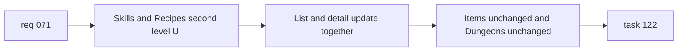

## item_251_implement_skills_and_recipes_two_level_wiki_navigation_ui - Implement skills and recipes two-level wiki navigation UI
> From version: 0.9.41
> Status: Ready
> Understanding: 95%
> Confidence: 95%
> Progress: 0%
> Complexity: Medium
> Theme: UI / Navigation / Information architecture
> Reminder: Update status/understanding/confidence/progress and linked task references when you edit this doc.

# Problem
- Once the shared navigation model is defined, the wiki still needs the actual UI behavior for the sections that are currently inconsistent.
- `Skills` and `Recipes` should adopt the same two-level reading pattern already established by `Items`.
- This implementation slice should normalize the active section behavior without yet taking on the mobile-specific layout treatment.

# Scope
- In:
- Add the secondary navigation UI for `Skills`.
- Add the secondary navigation UI for `Recipes`.
- Ensure the control updates the visible list and active detail entry coherently.
- Keep `Items` as the pattern reference and keep `Dungeons` unchanged.
- Preserve the current `list + detail` wiki structure.
- Out:
- Mobile-specific adaptive layout changes for narrow widths.
- Broad styling redesign outside the wiki navigation controls.
- Exhaustive regression coverage beyond the follow-up testing slice.

# Acceptance criteria
- `Skills` exposes a visible second-level selector for `Combat Skills` and `Gathering and Crafting Skills`.
- Switching the `Skills` secondary selector updates the list and detail panel coherently.
- `Recipes` exposes a visible second-level selector based on skill.
- Switching the `Recipes` secondary selector updates the list and detail panel coherently.
- `Items` keeps its current role as the reference implementation for second-level wiki navigation.
- `Dungeons` remains unchanged and does not gain an artificial secondary navigation layer.

# AC Traceability
- AC1 -> Scope: `Skills` secondary selector. Proof: UI exposes the two requested skill groups.
- AC2 -> Scope: `Skills` content switching. Proof: list and detail stay aligned after selection changes.
- AC3 -> Scope: `Recipes` secondary selector. Proof: UI exposes a skill-based selector.
- AC4 -> Scope: `Recipes` content switching. Proof: filtered recipe list and detail stay aligned.
- AC5 -> Scope: unchanged `Items` and `Dungeons`. Proof: no behavioral regression in those sections.

# Decision framing
- Product framing: Consider
- Product signals: navigation and discoverability
- Product follow-up: No product brief is required unless the wiki IA changes beyond the agreed two-level normalization.
- Architecture framing: Consider
- Architecture signals: data model and persistence, contracts and integration
- Architecture follow-up: No ADR is required unless the implementation introduces a broader routing or state-model change.

# Links
- Product brief(s): (none yet)
- Architecture decision(s): (none yet)
- Request: `logics/request/req_071_normalize_wiki_two_level_navigation.md`
- Primary task(s): `logics/tasks/task_122_execute_wiki_navigation_normalization_and_mobile_layout_across_backlog_items_250_to_253.md`

# Priority
- Impact: High
- Urgency: High

# Notes
- Derived from request `req_071_normalize_wiki_two_level_navigation`.
- Source file: `logics/request/req_071_normalize_wiki_two_level_navigation.md`.
- Request context seeded into this backlog item from `logics/request/req_071_normalize_wiki_two_level_navigation.md`.
- Likely touch points:
  - `src/app/components/WikiScreen.tsx`
  - `src/app/containers/WikiScreenContainer.tsx`
  - `src/app/wiki/wikiEntries.ts`
