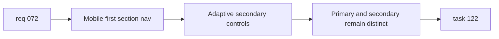

## item_252_build_mobile_first_wiki_navigation_layout_and_adaptive_secondary_controls - Build mobile first wiki navigation layout and adaptive secondary controls
> From version: 0.9.41
> Status: Ready
> Understanding: 95%
> Confidence: 95%
> Progress: 0%
> Complexity: Medium
> Theme: UI / Responsive design / Navigation
> Reminder: Update status/understanding/confidence/progress and linked task references when you edit this doc.

# Problem
- The wiki toolbar currently relies on wrapped chips, which works poorly on mobile once labels or filter counts grow.
- The main section switcher and the secondary controls need a mobile-specific layout so the hierarchy remains clear on narrow screens.
- This slice should improve the mobile presentation without creating a separate wiki implementation for mobile.

# Scope
- In:
- Rework the mobile layout of the main wiki section navigation so it no longer depends on multi-line wrapping.
- Add an adaptive secondary-navigation treatment for mobile:
  - short sets can stay in a horizontal row,
  - longer sets can use a compact select or dropdown pattern when needed.
- Keep level 1 and level 2 visually distinguishable on mobile.
- Preserve existing desktop behavior unless a small alignment change is needed for consistency.
- Out:
- Expanding wiki content scope.
- Replacing the wiki screen with a different information architecture.
- Exhaustive regression coverage beyond the dedicated testing item.

# Acceptance criteria
- On mobile widths, the main wiki section navigation no longer depends on wrapped multi-line chips.
- The level 1 section navigation remains readable and horizontally navigable on narrow screens.
- The secondary navigation can use a distinct mobile treatment when needed to preserve clarity.
- `Skills` remains easy to switch on mobile without layout breakage.
- `Recipes` can use a compact selector pattern on mobile if chip width becomes too large.
- `Items` mobile filters remain usable without unstable wrapping.
- Desktop wiki navigation behavior does not regress while improving the mobile layout.

# AC Traceability
- AC1 -> Scope: mobile main navigation. Proof: primary toolbar is single-row and horizontally navigable.
- AC2 -> Scope: mobile readability. Proof: labels stay usable on narrow widths without unstable wrapping.
- AC3 -> Scope: adaptive secondary treatment. Proof: long filter sets can use a compact control instead of overcrowded chips.
- AC4 -> Scope: `Skills`, `Recipes`, and `Items` mobile behavior. Proof: all remain operable on mobile widths.
- AC5 -> Scope: desktop non-regression. Proof: desktop wiki navigation still behaves as expected.

# Decision framing
- Product framing: Consider
- Product signals: navigation and discoverability
- Product follow-up: No product brief is required unless the mobile wiki surface needs a broader redesign.
- Architecture framing: Consider
- Architecture signals: data model and persistence
- Architecture follow-up: No ADR is required unless adaptive mobile controls force a larger route or state-model change.

# Links
- Product brief(s): (none yet)
- Architecture decision(s): (none yet)
- Request: `logics/request/req_072_improve_wiki_mobile_navigation_layout.md`
- Primary task(s): `logics/tasks/task_122_execute_wiki_navigation_normalization_and_mobile_layout_across_backlog_items_250_to_253.md`

# Priority
- Impact: High
- Urgency: High

# Notes
- Derived from request `req_072_improve_wiki_mobile_navigation_layout`.
- Source file: `logics/request/req_072_improve_wiki_mobile_navigation_layout.md`.
- Request context seeded into this backlog item from `logics/request/req_072_improve_wiki_mobile_navigation_layout.md`.
- Likely touch points:
  - `src/app/components/WikiScreen.tsx`
  - `src/app/styles/wiki.css`
  - `src/app/containers/WikiScreenContainer.tsx`
