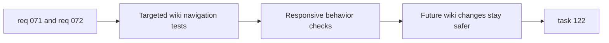

## item_253_add_regression_coverage_for_normalized_and_mobile_wiki_navigation - Add regression coverage for normalized and mobile wiki navigation
> From version: 0.9.41
> Status: Ready
> Understanding: 95%
> Confidence: 95%
> Progress: 0%
> Complexity: Medium
> Theme: Testing / UI regression / Responsive navigation
> Reminder: Update status/understanding/confidence/progress and linked task references when you edit this doc.

# Problem
- The wiki navigation changes in `req_071` and `req_072` affect view models, selection state, and responsive UI behavior.
- Without targeted regression coverage, future content or layout changes could easily break the normalized two-level flow or the mobile navigation treatment.
- This slice should lock down the expected behavior at the most important interaction points.

# Scope
- In:
- Add regression coverage for:
  - secondary navigation state resolution,
  - `Skills` and `Recipes` navigation behavior,
  - mobile navigation layout behavior at the interaction level,
  - non-regression of `Items` and unchanged `Dungeons` behavior.
- Cover route or selection persistence if the new state model changes current restoration behavior.
- Out:
- Exhaustive visual snapshot coverage.
- Broad E2E expansion outside the critical wiki navigation flows.

# Acceptance criteria
- Wiki tests cover normalized secondary navigation behavior for `Skills` and `Recipes`.
- Wiki tests cover non-regression for `Items` and unchanged `Dungeons` behavior where relevant.
- Responsive coverage is strong enough to catch the mobile navigation treatment regressing into unstable wrapping behavior.
- Route or selection restoration coverage is updated if the wiki state model changes.
- The test set is focused enough to stay maintainable while still protecting the core navigation contracts.

# AC Traceability
- AC1 -> Scope: `Skills` and `Recipes` navigation tests. Proof: interaction coverage asserts correct list/detail behavior.
- AC2 -> Scope: `Items` and `Dungeons` non-regression. Proof: unchanged sections still resolve valid behavior.
- AC3 -> Scope: responsive mobile checks. Proof: mobile navigation interaction and layout assumptions are exercised.
- AC4 -> Scope: restoration coverage. Proof: route or state persistence tests match the updated model.
- AC5 -> Scope: maintainable test strategy. Proof: tests stay focused on navigation contracts instead of broad snapshots.

# Decision framing
- Product framing: Consider
- Product signals: navigation and discoverability
- Product follow-up: No product brief is required for this testing slice.
- Architecture framing: Consider
- Architecture signals: data model and persistence
- Architecture follow-up: No ADR is required for this testing slice.

# Links
- Product brief(s): (none yet)
- Architecture decision(s): (none yet)
- Request: `logics/request/req_072_improve_wiki_mobile_navigation_layout.md`
- Primary task(s): `logics/tasks/task_122_execute_wiki_navigation_normalization_and_mobile_layout_across_backlog_items_250_to_253.md`

# Priority
- Impact: Medium
- Urgency: High

# Notes
- Derived from request `req_072_improve_wiki_mobile_navigation_layout`.
- Source file: `logics/request/req_072_improve_wiki_mobile_navigation_layout.md`.
- Request context seeded into this backlog item from `logics/request/req_072_improve_wiki_mobile_navigation_layout.md`.
- Also protects behavior introduced by `logics/request/req_071_normalize_wiki_two_level_navigation.md`.
- Likely touch points:
  - `tests/app/wikiScreen.test.tsx`
  - `tests/app/wikiEntries.test.ts`
  - `tests/app/App.test.tsx`
