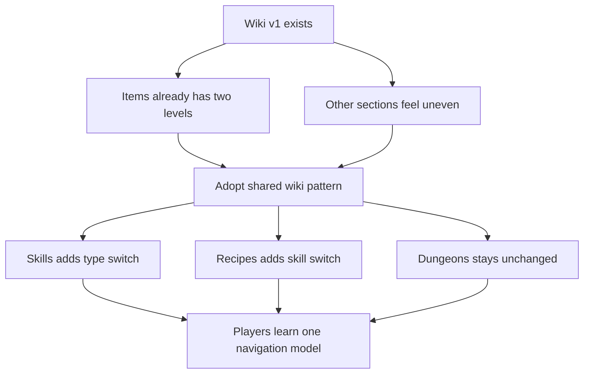

## req_071_normalize_wiki_two_level_navigation - Normalize wiki two-level navigation
> From version: 0.9.41
> Status: Ready
> Understanding: 95%
> Confidence: 95%
> Complexity: Medium
> Theme: UI
> Reminder: Update status/understanding/confidence and references when you edit this doc.

# Needs
- The wiki needs a more consistent navigation model between sections.
- `Items` already establishes the intended pattern with two visible levels:
  - section selection,
  - a second level of top filters such as `All items` and `Currency`.
- The other wiki sections still feel uneven compared with `Items`, which makes the overall wiki harder to scan and learn.
- The project needs a follow-up pass that turns the `Items` navigation shape into the shared wiki standard where it adds value.

# Context
- `req_026_game_wiki` shipped the first in-game wiki as a mobile-ready list-detail reference surface.
- That first version already introduced section-level navigation for:
  - `skills`
  - `recipes`
  - `items`
  - `dungeons`
- In practice, `Items` currently provides the clearest reading pattern because it already exposes a second-level category switch inside the section.
- The other sections should now align to that navigation rule so players do not have to relearn the page structure from one section to another.
- Current direction for this follow-up:
  - `Items` stays the reference pattern and should not be redesigned away from its current two-level logic.
  - `Skills` should expose a top selection between combat skills and gathering/crafting skills.
  - `Recipes` should expose a top selection by parent skill.
  - `Dungeons` should remain unchanged for now because the content depth is still too thin to justify a second level.
- This is a wiki information architecture and navigation consistency request, not a full content rewrite.

# Goals
- Make wiki navigation more predictable from one section to another.
- Reuse the `Items` navigation logic as the baseline pattern instead of inventing a different structure per section.
- Improve scanability and section comprehension without adding heavy search or deeper routing complexity.

# Non-goals
- Rebuilding the whole wiki information model from scratch.
- Expanding dungeon content just to justify a new navigation layer.
- Introducing full text search, deep cross-linking, or editorial-heavy pages as part of this change.

# Scope detail (draft)
## Shared navigation rule
- Treat the wiki as a two-level navigation surface when a section has enough internal grouping to justify it.
- Level 1 stays the main section switcher:
  - `Skills`
  - `Recipes`
  - `Items`
  - `Dungeons`
- Level 2 appears inside the active section as the visible sub-navigation or filter bar for that section.
- `Items` is the canonical reference for this pattern.

## Section-specific direction
### Items
- Keep the existing second-level navigation behavior as the product reference.
- Preserve the current feel of entries such as `All items` and `Currency`.

### Skills
- Add a second-level selection at the top of the section.
- The section should let the player switch between:
  - `Combat Skills`
  - `Gathering and Crafting Skills`
- The selected skill type should drive the list-detail content shown below.

### Recipes
- Add a second-level selection at the top of the section.
- Recipes should be segmented by parent skill.
- The selected skill should drive which recipe entries are shown below.

### Dungeons
- Keep the current section behavior unchanged for now.
- Do not add a placeholder second-level navigation only for symmetry.
- Revisit this only when dungeon content depth justifies real grouping.

# Product and architecture constraints
- The wiki should keep one coherent UI language across sections instead of section-specific navigation experiments.
- The second-level control should stay immediately visible and easy to understand.
- The change should build on the existing wiki route, state model, and list-detail layout instead of replacing them.
- The navigation model should remain mobile-ready and not rely on desktop-only affordances.
- If section routing or restoration changes are needed, they should remain incremental and compatible with the current wiki behavior.

# Technical references likely impacted
- `src/app/components/WikiScreen.tsx`
- `src/app/containers/WikiScreenContainer.tsx`
- `src/app/wiki/wikiEntries.ts`
- `src/app/wiki/wikiModel.ts`
- `src/app/styles/wiki.css`
- `tests/app/wikiScreen.test.tsx`
- `tests/app/wikiEntries.test.ts`
- `tests/app/App.test.tsx`

# Acceptance criteria
- The wiki continues to use the current list-detail layout and main section switcher.
- `Items` remains the reference implementation for second-level wiki navigation.
- `Skills` exposes a second-level top selector with:
  - `Combat Skills`
  - `Gathering and Crafting Skills`
- Switching the `Skills` second level updates the visible skill list and detail selection coherently.
- `Recipes` exposes a second-level top selector based on skill.
- Switching the `Recipes` second level updates the visible recipe list and detail selection coherently.
- `Dungeons` remains unchanged and does not add an artificial second-level navigation layer.
- The navigation pattern remains readable and usable on both desktop and mobile.
- Existing wiki entry selection and route behavior do not regress during the navigation update.

# Test expectations
- Follow-up execution should expect:
  - app tests for wiki section and sub-filter behavior,
  - route behavior regression coverage where the state model changes,
  - responsive navigation checks for the updated wiki toolbar behavior.

# Risks and open points
- Forcing a second level into sections with weak grouping would make the wiki feel more artificial, not clearer.
- `Recipes` may need a careful default selection rule so first render stays intuitive.
- If `Skills` and `Recipes` use different UI behavior for the second level, the normalization goal will be weakened.

# Follow-up candidates
- shared wiki sub-navigation model or helper contract
- wiki route state extension for section-level filters if needed
- regression coverage for section filter persistence and default selection behavior

# Definition of Ready (DoR)
- [x] Problem statement is explicit and user impact is clear.
- [x] Scope boundaries (in/out) are explicit.
- [x] Acceptance criteria are testable.
- [x] Dependencies and known risks are listed.

# Companion docs
- Product brief(s): (none yet)
- Architecture decision(s): (none yet)

# Backlog
- `logics/backlog/item_250_define_shared_wiki_secondary_navigation_contracts_and_state_behavior.md`
- `logics/backlog/item_251_implement_skills_and_recipes_two_level_wiki_navigation_ui.md`
