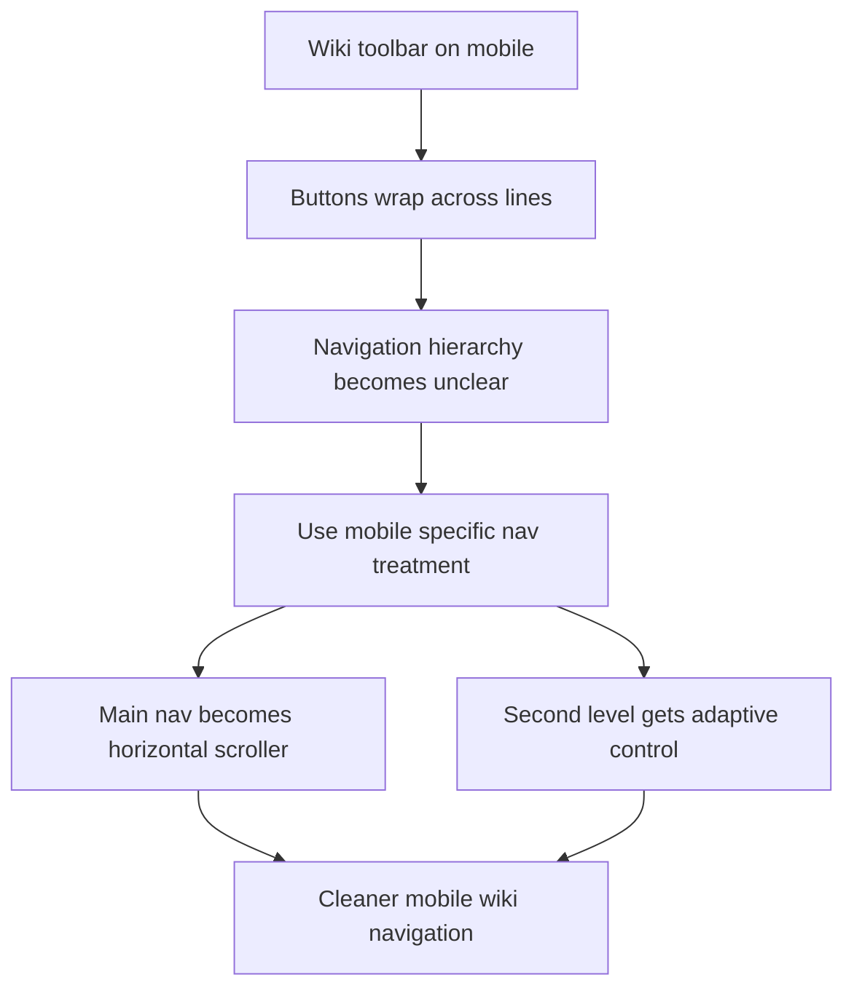

## req_072_improve_wiki_mobile_navigation_layout - Improve wiki mobile navigation layout
> From version: 0.9.41
> Status: Ready
> Understanding: 95%
> Confidence: 95%
> Complexity: Medium
> Theme: UI
> Reminder: Update status/understanding/confidence and references when you edit this doc.

# Needs
- The wiki navigation is not arranged well enough on mobile when labels become too wide for the available space.
- The current toolbar pattern wraps navigation chips across multiple lines, which weakens readability and makes the hierarchy harder to understand.
- The project needs a mobile-specific navigation treatment so the wiki remains compact, legible, and easy to operate on narrow screens.

# Context
- The current wiki uses the same chip-style toolbar pattern for:
  - the main section navigation,
  - the optional second-level filters inside a section.
- On desktop this remains acceptable, but on mobile the available width is too limited for some labels and combinations.
- When the buttons wrap, the player loses a clear reading order:
  - it becomes less obvious which buttons are the main section switcher,
  - and which controls belong to the active section as a second level.
- `req_071_normalize_wiki_two_level_navigation.md` defines the product direction for a broader two-level wiki navigation model.
- This request focuses specifically on the mobile layout behavior needed to make that model usable once section and sub-section controls become denser.
- Likely mobile pressure points:
  - section labels such as `Dungeons`,
  - longer second-level labels,
  - future recipe-by-skill navigation where the filter list may become too wide for chips alone.

# Goals
- Keep wiki navigation readable and controllable on mobile widths.
- Preserve a clear distinction between level 1 section navigation and level 2 section-specific filters.
- Avoid fragile layouts where button text wrapping dictates the visual structure.

# Non-goals
- Redesigning the full wiki screen beyond navigation behavior.
- Adding more wiki sections or deeper content as part of this request.
- Forcing one identical control type on every second-level navigation regardless of content density.

# Scope detail (draft)
## Mobile navigation principle
- Do not rely on wrapped chip rows for primary mobile navigation.
- On mobile, the navigation should preserve a clear left-to-right reading order even when labels are longer than the viewport can comfortably fit.

## Level 1 navigation
- The main wiki section switcher should use a horizontally scrollable single-row treatment on mobile.
- The main section navigation should stay visually compact and consistently placed.
- It should remain obvious that this row controls the top-level section:
  - `Skills`
  - `Recipes`
  - `Items`
  - `Dungeons`

## Level 2 navigation
- The second-level navigation should use a different mobile treatment from level 1 when that improves clarity.
- For short filter sets, a horizontally scrollable chip row is acceptable.
- For longer filter sets, especially recipe-by-skill selection, a mobile-friendly dropdown or select-style control is acceptable and preferred over overcrowded wrapped chips.
- The product goal is adaptive clarity, not rigid uniformity at any cost.

## Initial direction by section
### Skills
- Mobile navigation can use a short horizontal second-level control because the two options are limited:
  - `Combat Skills`
  - `Gathering and Crafting Skills`

### Recipes
- Mobile navigation should allow a more compact selector treatment if the list of skills becomes too wide for a clean chip row.
- A select or dropdown-style mobile control is acceptable here.

### Items
- If the item filter count remains small, a horizontal chip row remains acceptable on mobile.
- The row should not wrap into a visually unstable multi-line layout.

### Dungeons
- No new second-level mobile control is required while the section remains unchanged.

# Product and architecture constraints
- The mobile solution should build on the current wiki screen rather than introducing a separate mobile-only wiki implementation.
- Level 1 and level 2 controls should remain visually distinguishable.
- The chosen layout should still support current and upcoming wiki route state behavior.
- The navigation should remain touch-friendly and easy to scan without adding heavy UI chrome.
- The solution should be compatible with the current responsive wiki layout and not regress desktop behavior.

# Technical references likely impacted
- `src/app/components/WikiScreen.tsx`
- `src/app/styles/wiki.css`
- `src/app/containers/WikiScreenContainer.tsx`
- `src/app/wiki/wikiModel.ts`
- `tests/app/wikiScreen.test.tsx`
- `tests/app/App.test.tsx`

# Acceptance criteria
- On mobile widths, the main wiki section navigation no longer depends on wrapped multi-line chips.
- The level 1 section navigation remains readable and horizontally navigable on narrow screens.
- The level 2 navigation can use a distinct mobile treatment when needed to preserve clarity.
- `Skills` remains easy to switch on mobile without layout breakage.
- `Recipes` can use a compact selector pattern on mobile if chip width becomes too large.
- `Items` mobile filters remain usable without unstable wrapping.
- Desktop wiki navigation behavior does not regress while improving the mobile layout.
- The mobile navigation hierarchy remains understandable at a glance:
  - top-level section control,
  - section-specific secondary control.

# Test expectations
- Follow-up execution should expect:
  - app tests for mobile wiki navigation rendering behavior,
  - responsive regression coverage around section and filter controls,
  - targeted checks that level 1 and level 2 controls still drive the expected route or selection state.

# Risks and open points
- A fully scrollable chip solution for both levels may still feel too visually similar between primary and secondary navigation.
- A select control for `Recipes` improves density, but may reduce immediate discoverability if styled poorly.
- If mobile behavior diverges too far from desktop behavior, maintenance complexity may grow unnecessarily.

# Follow-up candidates
- shared responsive wiki navigation primitives
- route-state persistence rules for adaptive mobile controls
- visual affordances for horizontal scroll hinting on the main wiki section bar

# Definition of Ready (DoR)
- [x] Problem statement is explicit and user impact is clear.
- [x] Scope boundaries (in/out) are explicit.
- [x] Acceptance criteria are testable.
- [x] Dependencies and known risks are listed.

# Companion docs
- Product brief(s): (none yet)
- Architecture decision(s): (none yet)

# Backlog
- `logics/backlog/item_252_build_mobile_first_wiki_navigation_layout_and_adaptive_secondary_controls.md`
- `logics/backlog/item_253_add_regression_coverage_for_normalized_and_mobile_wiki_navigation.md`
