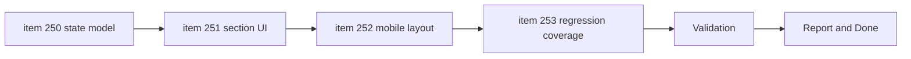

## task_122_execute_wiki_navigation_normalization_and_mobile_layout_across_backlog_items_250_to_253 - Execute wiki navigation normalization and mobile layout across backlog items 250 to 253
> From version: 0.9.41
> Status: Ready
> Understanding: 95%
> Confidence: 95%
> Progress: 0%
> Complexity: High
> Theme: UX / Navigation / Responsive UI
> Reminder: Update status/understanding/confidence/progress and dependencies/references when you edit this doc.

# Context
Derived from:
- `logics/backlog/item_250_define_shared_wiki_secondary_navigation_contracts_and_state_behavior.md`
- `logics/backlog/item_251_implement_skills_and_recipes_two_level_wiki_navigation_ui.md`
- `logics/backlog/item_252_build_mobile_first_wiki_navigation_layout_and_adaptive_secondary_controls.md`
- `logics/backlog/item_253_add_regression_coverage_for_normalized_and_mobile_wiki_navigation.md`

Request references:
- `logics/request/req_071_normalize_wiki_two_level_navigation.md`
- `logics/request/req_072_improve_wiki_mobile_navigation_layout.md`

This task orchestrates the next wiki iteration after the initial `/wiki` delivery. The implementation must:
- normalize section navigation around the existing `Items` two-level pattern,
- apply that pattern to `Skills` and `Recipes`,
- keep `Dungeons` unchanged for now,
- and make the resulting navigation actually usable on mobile widths.

# Plan
- [ ] 1. Execute `item_250`:
  - Define the shared wiki secondary-navigation contract.
  - Resolve default selection and route or state behavior for supported sections.
- [ ] 2. Execute `item_251`:
  - Implement the second-level wiki navigation for `Skills`.
  - Implement the second-level wiki navigation for `Recipes`.
  - Keep `Items` as the reference pattern and keep `Dungeons` unchanged.
- [ ] 3. Execute `item_252`:
  - Rework mobile wiki navigation so the main section bar does not rely on unstable wrapping.
  - Apply adaptive mobile treatment to the secondary controls where needed.
- [ ] 4. Execute `item_253`:
  - Add targeted regression coverage for state, UI behavior, and responsive navigation.
  - Protect `Items` and unchanged `Dungeons` behavior from collateral regressions.
- [ ] FINAL: Update related Logics docs

# AC Traceability
- AC1 -> `item_250`: shared secondary-navigation contract and restoration rules exist. Proof: wiki state and container logic updated coherently.
- AC2 -> `item_251`: `Skills` and `Recipes` expose working second-level navigation. Proof: section interactions update list and detail views coherently.
- AC3 -> `item_252`: mobile wiki navigation stays readable and usable. Proof: main toolbar and secondary controls behave on narrow widths without unstable wrapping.
- AC4 -> `item_253`: regression coverage protects the new navigation contracts. Proof: tests cover state, section behavior, and responsive interaction assumptions.

# Decision framing
- Product framing: Consider
- Product signals: navigation and discoverability
- Product follow-up: No product brief is required unless the wiki scope broadens during implementation.
- Architecture framing: Not needed
- Architecture signals: (none detected)
- Architecture follow-up: No architecture decision follow-up is expected based on current signals.

# Links
- Product brief(s): (none yet)
- Architecture decision(s): (none yet)
- Backlog item: `logics/backlog/item_250_define_shared_wiki_secondary_navigation_contracts_and_state_behavior.md`
- Backlog item: `logics/backlog/item_251_implement_skills_and_recipes_two_level_wiki_navigation_ui.md`
- Backlog item: `logics/backlog/item_252_build_mobile_first_wiki_navigation_layout_and_adaptive_secondary_controls.md`
- Backlog item: `logics/backlog/item_253_add_regression_coverage_for_normalized_and_mobile_wiki_navigation.md`
- Request(s): `logics/request/req_071_normalize_wiki_two_level_navigation.md`
- Request(s): `logics/request/req_072_improve_wiki_mobile_navigation_layout.md`

# Validation
- `npm run lint`
- `npm run typecheck`
- `npm run typecheck:tests`
- `npm run test:ci`
- Recommended if wiki interactions or layout behavior change significantly:
  - `npm run test:e2e`
  - `npm run ci:local:fast`

# Definition of Done (DoD)
- [ ] Scope implemented and acceptance criteria covered.
- [ ] Validation commands executed and results captured.
- [ ] Linked request/backlog/task docs updated.
- [ ] Status is `Done` and progress is `100%`.

# Report
