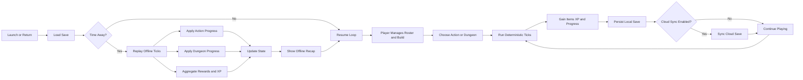

# Sentry

Sentry is a TypeScript + React idle RPG focused on roster progression, dungeon runs, and offline continuity.

## Overview

Sentry includes:

- Multi-hero roster progression (actions, crafting, equipment, economy).
- Dungeon simulation with live arena rendering (PixiJS) and replay controls.
- Offline catch-up recap when returning to the app.
- Local save import/export/reset.
- Cloud save sync (auth, conflict view, profile username).
- Leaderboard (virtual score) and changelog feed (GitHub commits).
- PWA support with service worker caching and update prompt.

```mermaid
flowchart TD
    S[Sentry]
    S --> R[Roster Progression]
    S --> D[Dungeon]
    S --> P[Persistence]
    S --> O[Online Services]
    S --> U[Platform UX]

    R --> R1[Heroes]
    R --> R2[Actions and Crafting]
    R --> R3[Equipment and Inventory]
    R --> R4[Economy and Quests]

    D --> D1[Party Runs]
    D --> D2[Live Arena Rendering]
    D --> D3[Replay Controls]
    D --> D4[Boss Phases]

    P --> P1[Offline Catch-up]
    P --> P2[Local Save Import Export Reset]
    P --> P3[Save Migration and Recovery]

    O --> O1[Cloud Save Sync]
    O --> O2[Leaderboard]
    O --> O3[Changelog Feed]
    O --> O4[Profile Username]

    U --> U1[PWA Caching]
    U --> U2[Update Prompt]
    U --> U3[System Modals and Telemetry]
```

## Key Systems

### Gameplay

- Idle loop + deterministic tick runtime.
- Party dungeon runs with boss phases and replay playback speed controls.
- Inventory, equipment, shop, quests, action journal, telemetry.

### System modal

- `Journal`
- `Telemetry`
- `Graphics`
- `Save` (local + cloud)
- `Leaderboard`
- `Changelogs`
- `Crash reports` (when available)
- `About` (GitHub link)

### Save flows

- Local export uses a compressed envelope (`schemaVersion: 3`, `deflate-base64`) with SHA-256 checksum.
- Local import accepts current compressed saves and legacy formats.
- Cloud save stores payload + metadata (`updatedAt`, `virtualScore`, `appVersion`).

## Tech Stack

- **Frontend:** React 19, TypeScript, Vite, custom CSS, SweetAlert2.
- **Rendering:** PixiJS (dungeon arena).
- **Backend (optional):** Fastify, Prisma, PostgreSQL, JWT + refresh tokens.
- **Testing:** Vitest, Testing Library, Playwright, jest-axe.
- **Quality:** ESLint, TypeScript typecheck, bundle budget script.

## Project Structure

- `src/app`: UI components, hooks, containers, selectors, styling.
- `src/core`: game loop, reducer, serialization, dungeon domain.
- `src/adapters/persistence`: save envelopes, migrations, storage helpers.
- `src/pwa`: service worker registration/update flow.
- `src/observability`: crash reporting and diagnostics.
- `src/store`: app/game store.
- `backend`: Fastify API server.
- `prisma`: Prisma schema + migrations.
- `tests`: unit/integration/E2E/backend/script tests.
- `public`: PWA manifest, service worker, static assets.
- `scripts`: helper scripts (tests, bundle budget, db utilities).
- `logics`: product requests/backlog/tasks and automation docs.

## Requirements

- Node.js `>= 20`
- npm
- PostgreSQL (only if using cloud backend)

## Getting Started (Frontend only)

1. Clone:
   - `git clone https://github.com/AlexAgo83/sentry.git`
2. Initialize submodules (needed for logics tooling used in CI):
   - `git submodule update --init --recursive`
3. Install dependencies:
   - `npm ci`
4. Start app:
   - `npm run dev`

## Full-Stack Setup (Frontend + Backend)

1. Create env file:
   - `cp .env.example .env`
2. Set required backend env values (`JWT_SECRET`, `DATABASE_URL`, etc.).
3. Generate Prisma client and run migrations:
   - `npm run prisma:generate`
   - `npm run prisma:migrate`
4. Start backend:
   - `npm run backend:dev`
5. Ensure frontend points to backend:
   - set `VITE_API_BASE=http://localhost:8787`

## Environment Variables

### Frontend / Vite

- `VITE_API_BASE`: backend API base URL for cloud save, leaderboard, changelogs.
- `VITE_OFFLINE_CAP_DAYS`: offline progression cap in days.
- `VITE_PROD_RENDER_API_BASE`: optional production backend warmup URL.
- `PROD_RENDER_API_BASE`: same value injected at build-time for production warmup.
- `VITE_E2E`: used by Playwright runs.

### Backend

- `API_PORT`: API port (default `8787`).
- `JWT_SECRET`: required JWT signing secret.
- `COOKIE_SECRET`: cookie signing secret (falls back to `JWT_SECRET`).
- `DATABASE_URL`: PostgreSQL connection string.
- `ACCESS_TOKEN_TTL_MINUTES`: access token lifetime.
- `REFRESH_TOKEN_TTL_DAYS`: refresh token lifetime.

### Changelog feed (backend)

- `GITHUB_OWNER`: repository owner.
- `GITHUB_REPO`: repository name.
- `GITHUB_TOKEN` (optional): server-side token for better GitHub API rate limits.

`GITHUB_TOKEN` must stay server-side only (never exposed as `VITE_*`).

### DB utility helpers

- `DATABASE_URL_LOCAL`, `DATABASE_URL_RENDER`
- `PGSSL_DISABLE`
- `SCHEMA_RESET_FORCE`

## API Surface (Backend)

- `GET /health`
- `POST /api/v1/auth/register`
- `POST /api/v1/auth/login`
- `POST /api/v1/auth/refresh`
- `GET /api/v1/saves/latest`
- `PUT /api/v1/saves/latest`
- `GET /api/v1/users/me/profile`
- `PATCH /api/v1/users/me/profile`
- `GET /api/v1/leaderboard`
- `GET /api/changelog/commits`

## NPM Scripts

### App lifecycle

- `npm run dev`: Vite dev server.
- `npm run dev:debug`: Vite with debug logs.
- `npm run live`: alias of `dev`.
- `npm run build`: production build.
- `npm run preview`: preview built app.

### Quality & tests

- `npm run lint`
- `npm run typecheck`
- `npm run typecheck:tests`
- `npm run tests`: local Vitest runner via `scripts/run-tests.js`.
- `npm run test:ci`: CI Vitest config.
- `npm run ci:local:fast`: fast local mirror of the blocking CI workflow.
- `npm run ci:local`: full local mirror of the blocking CI workflow.
- `npm run coverage`
- `npm run coverage:ci`
- `npm run test:e2e`: Playwright smoke tests.
- `npm run test:full`: full battery (`lint + typecheck + tests + coverage + build + e2e`).
- `npm run bundle:check`: bundle budgets.

### Backend / database

- `npm run backend:dev`
- `npm run backend:start`
- `npm run prisma:generate`
- `npm run prisma:migrate`
- `npm run db:dump`
- `npm run db:dump:render`
- `npm run db:restore`
- `npm run db:restore:render`
- `npm run db:reset:dump`
- `npm run db:reset:dump:render`

## PWA & Offline Behavior

- Service worker is registered in production builds.
- Navigation requests use cache-first with background refresh.
- Static assets use stale-while-revalidate behavior.
- API requests (`/api/*`) are never cached by the service worker.
- The app surfaces an update prompt when a new service worker is available.

## CI

GitHub Actions CI on `push`/`pull_request` to `main` runs:

1. `npm ci`
2. `npm run ci:local`

Local parity commands:

- `npm run ci:local:fast`: fast repo gate for day-to-day checks.
- `npm run ci:local`: full blocking mirror, including Logics gates, lane validation, compatibility coverage, Playwright, audit, build, bundle budgets, and offline recap smoke.

Security note:

- PR/push CI fails only on `high` (or above) `npm audit` findings to avoid non-deterministic red builds from newly published moderate advisories.
- A scheduled workflow (`Security audit`) runs `npm audit --audit-level=moderate` in report-only mode.

## Notes

- Usernames in cloud profile are optional, unique, max 16 chars, alphanumeric only.
- Leaderboard ordering uses `virtualScore DESC`, then newest save update.
- Equal virtual scores are flagged as `ex aequo` in leaderboard entries.

## Contributing

See `CONTRIBUTING.md`.

## License

MIT (`LICENSE`).
